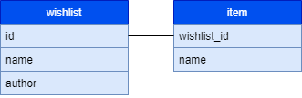

# amazonia


Amazonia is a web app for tracking wish lists and their completion

## Available Scripts

In the project directory, you can run:

### `npm start`

Runs the app in the development mode.\
Open [http://localhost:3000](http://localhost:3000) to view it in the browser.

The page will reload if you make edits.\
You will also see any lint errors in the console.

### `npm test`

Launches the test runner in the interactive watch mode.

### `npm run server`

Runs the server on [http://localhost:3001](http://localhost:3001)
The available endpoints are:

- `GET /wishlist`
- `GET /wishlist/:id`
- `POST /wishlist`
- `DELETE /wishlist/:id`
- `PUT /wishlist/:id`
- `PATCH /item/:id`
- `DELETE /item/:id`

### `npm run migrate`

Runs the database migrations

### `npm run rollback`

Rolls back the database migrations

### `npm run seed`

Clears the database and seeds it with some data

### `npm run build`

Builds the app for production to the `build` folder.\
It correctly bundles React in production mode and optimizes the build for the best performance.

The build is minified and the filenames include the hashes.\
Your app is ready to be deployed!

See the section about [deployment](https://facebook.github.io/create-react-app/docs/deployment) for more information.

### Database Schema

Here is a diagram of the database schema:



### Environment Variables

to set your environment variables, create a file called `.env` and put this into it:

```
DB_HOST=localhost
DB_USER=postgres
DB_NAME=amazonia
DB_PASS=
```

be sure to enter your password.

### Starting/Stopping your postgres server

- Windows:
  - start: `pg_ctl -D "C:\Program Files\PostgreSQL\13\data" start`
  - stop: `pg_ctl -D "C:\Program Files\PostgreSQL\13\data" stop`
  - restart: `pg_ctl -D "C:\Program Files\PostgreSQL\13\data" restart`
- Mac:
  - start: `pg_ctl -D /usr/local/var/postgres start`
  - stop: `pg_ctl -D /usr/local/var/postgres stop`
